# Panoptic Segmentation

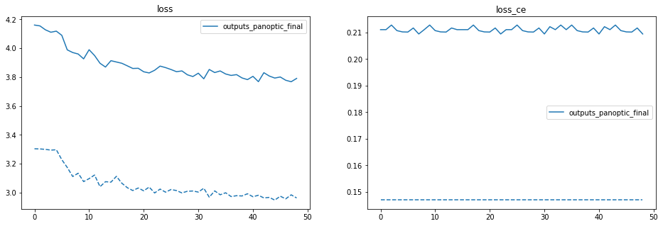

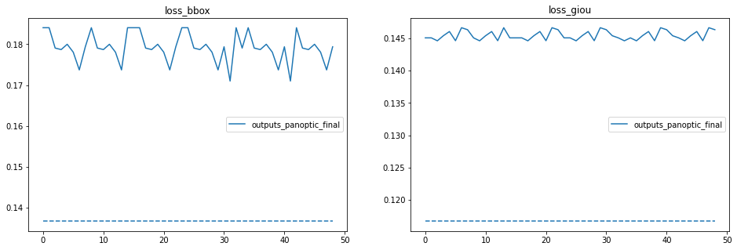

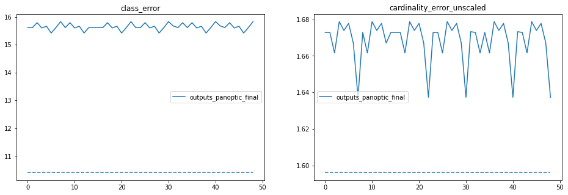

## Few Prediction examples

|                        Original Image                        |                    Predicted Bounding Box                    |
| :----------------------------------------------------------: | :----------------------------------------------------------: |
|   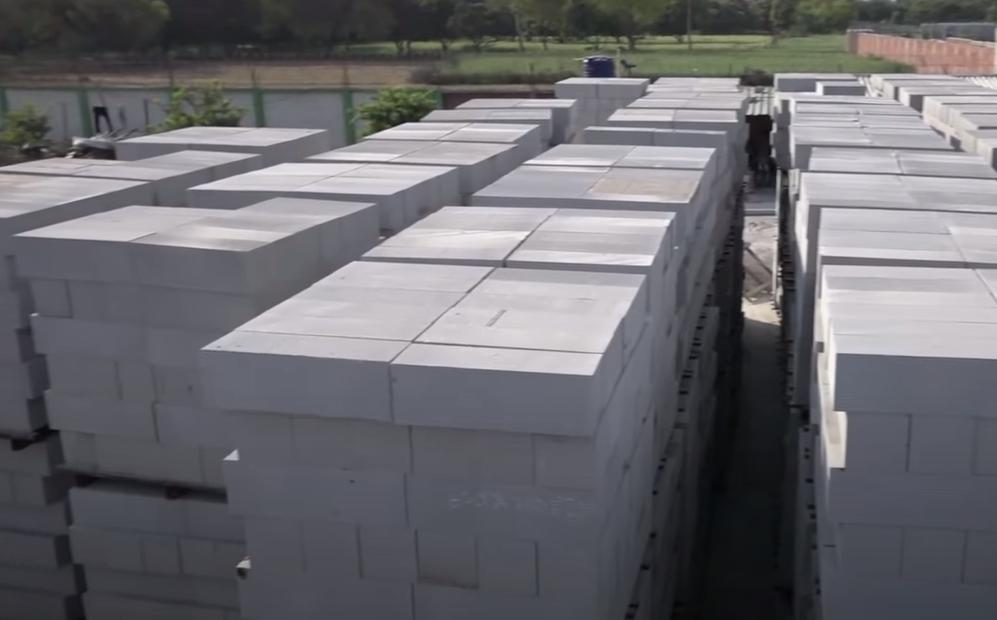    | 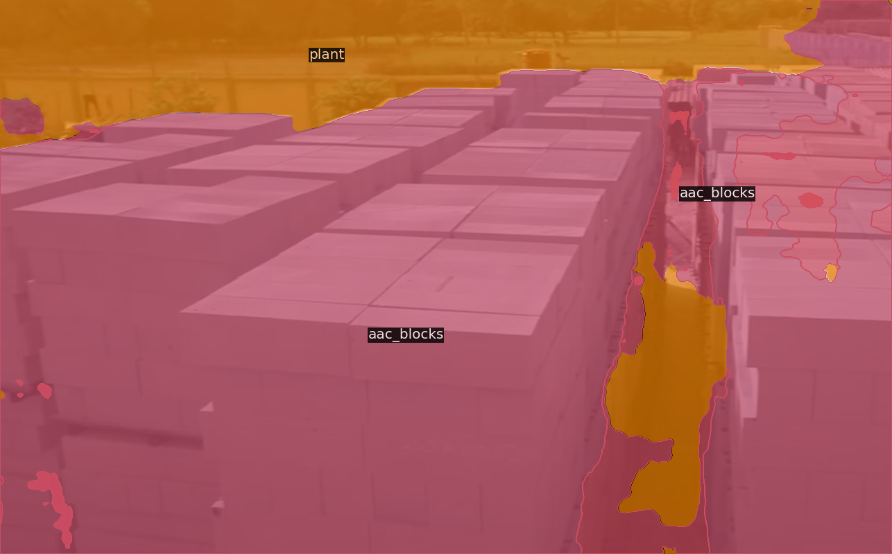 |
| 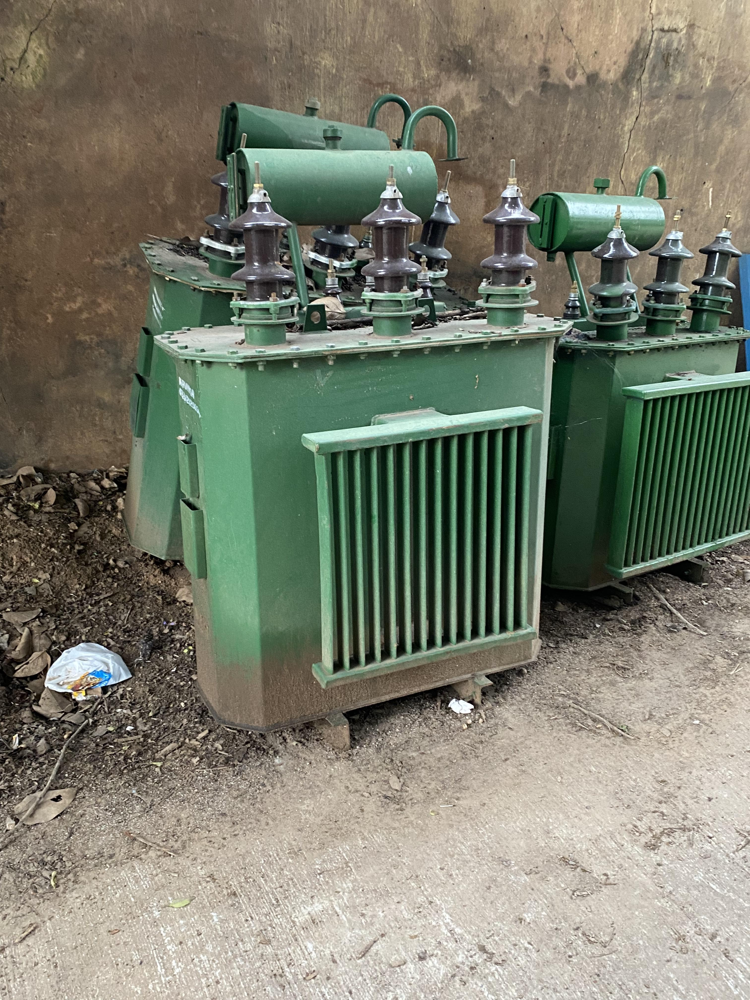 | 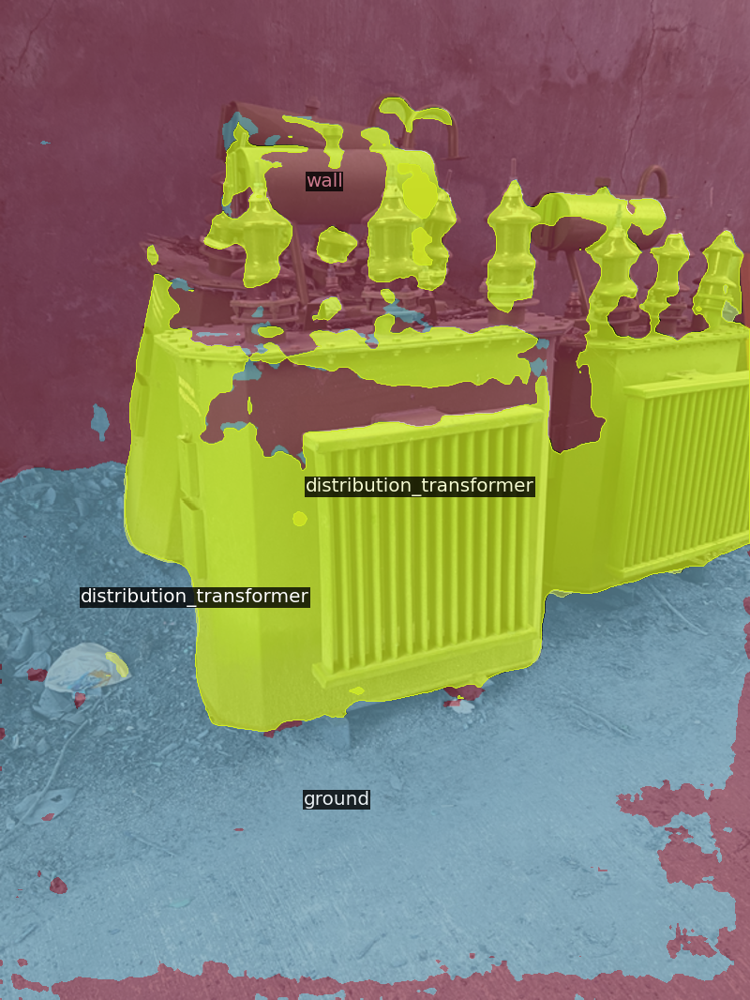 |
|     | 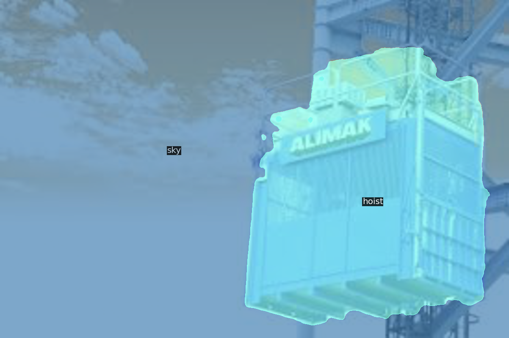 |
|     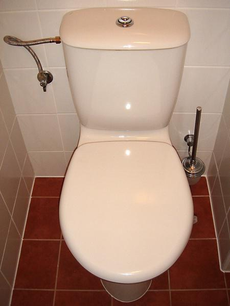      | 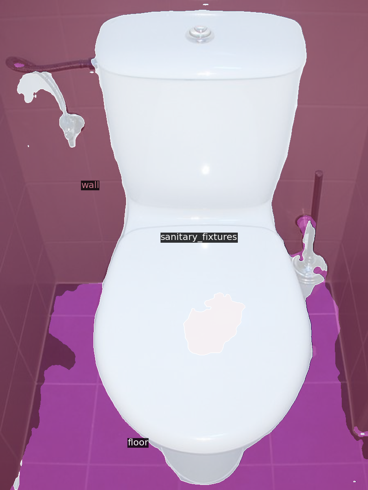 |
|        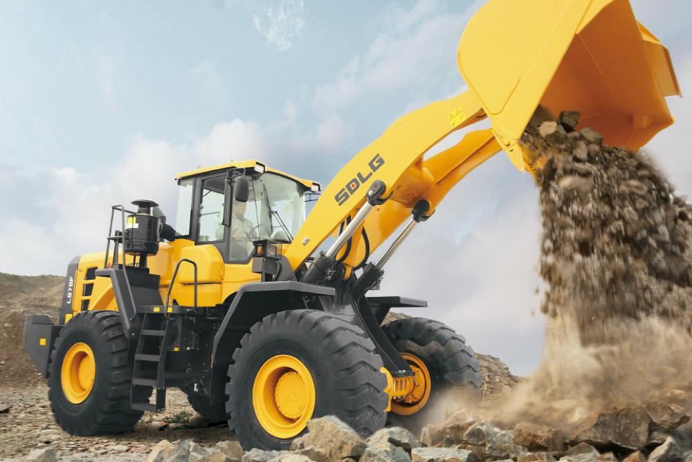        | 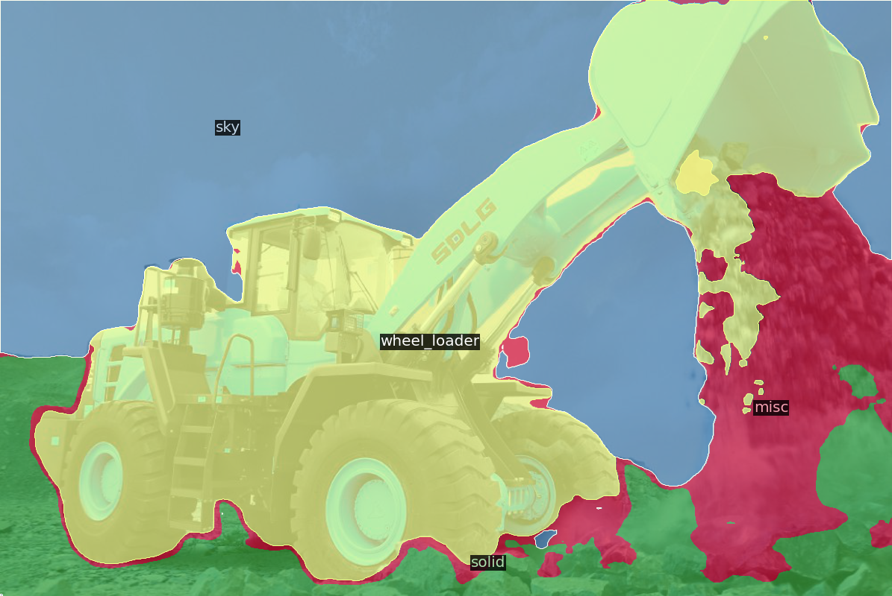 |

